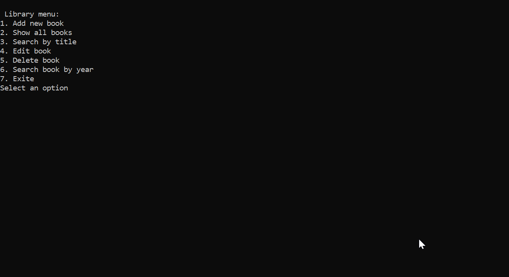

# C# Console Library App

This is a simple console application to manage books in a small library.  
It’s a project I built to practice C# basics like OOP, LINQ, and separating logic from UI.

## What You Can Do

- Add a new book (Title, Author, Pages, Year)
- See all books in the library
- Edit by name
- Search for a book by title or author
- Delete a book
- Count books by authors for a specific year

## How It Works

- The program uses a menu to guide you through all actions.
- It validates the input (pages must be 1–2000, year must be 1920–current year)
- The logic (Library class) is separated from the user interface (Menu class).

## How to Run

1. Open the solution in Visual Studio
2. Build the project
3. Press **Ctrl + F5** to run
4. Use the menu to add, search, or delete books

This project is a simple example of:

- **Encapsulation** (validating pages and year)
- **LINQ** (searching and grouping books)
- **Separation of concerns** (UI vs. logic)

Feel free to try it and explore!
